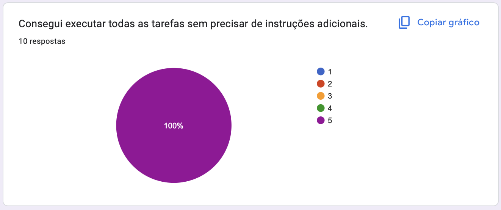
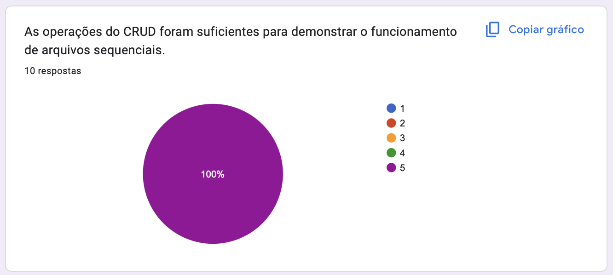
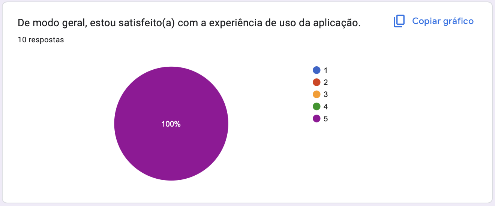

# Relatório

### 1. Roteiro de Teste

Os participantes receberam o seguinte roteiro para executar no sistema:

- A. Cadastre um produto chamado “Caixa Azul”, GTIN 1234567890123, descrição “Produto de teste” e o ícone de Caixa.

- B. Localize o produto cadastrado e verifique se suas informações estão corretas.

- C. Atualize o nome para “Caixa Azul Grande”.

- D. Exclua o produto utilizando a função de exclusão lógica (lápide).

- E. Verifique na listagem se o produto aparece como excluído.

- F. Abra a aba com a visualização HEX e verifique como o registro foi armazenado no arquivo.

Esse roteiro garante que o usuário passe por todas as operações do CRUD, além de visualizar a representação binária, que é o foco educacional do trabalho.

---

### 2. Avaliação de Utilidade e Usabilidade (Escala Likert)
Os usuários responderam às afirmativas abaixo, marcando um valor de 1 a 5:
- 1️⃣ Discordo totalmente
- 2️⃣ Discordo
- 3️⃣ Neutro
- 4️⃣ Concordo
- 5️⃣ Concordo totalmente

#### Afirmativas sobre Utilidade e Usabilidade:
* Consegui executar todas as tarefas sem precisar de instruções adicionais.

* As operações do CRUD foram suficientes para demonstrar o funcionamento de arquivos sequenciais.

* A visualização em HEX facilita a compreensão da estrutura interna dos registros.

* O sistema ilustra bem o conceito de lápide e exclusão lógica.

* A interface é clara e fácil de navegar.

* De modo geral, estou satisfeito(a) com a experiência de uso da aplicação.

---

### 3. Resumo das Avaliações

| Afirmação | Média das Respostas |
| :--- | :---: |
| Consegui executar todas as tarefas sem precisar de instruções adicionais | 5 |
| As operações do CRUD foram suficientes para demonstrar o funcionamento | 5 |
| A visualização em HEX facilita a compreensão da estrutura dos registros | 4,9 |
| O sistema ilustra bem o conceito de lápide e exclusão lógica | 4,9 |
| A interface é clara e fácil de navegar | 4,9 |
| De modo geral, estou satisfeito(a) com a experiência de uso da aplicação | 5 |

   
  
  
  
  
  
  
   

---
### Aqui está o pdf com todas as respostas:

### [📋 Relatório PDF](./docs/Avaliação%20-%20TP4.pdf)